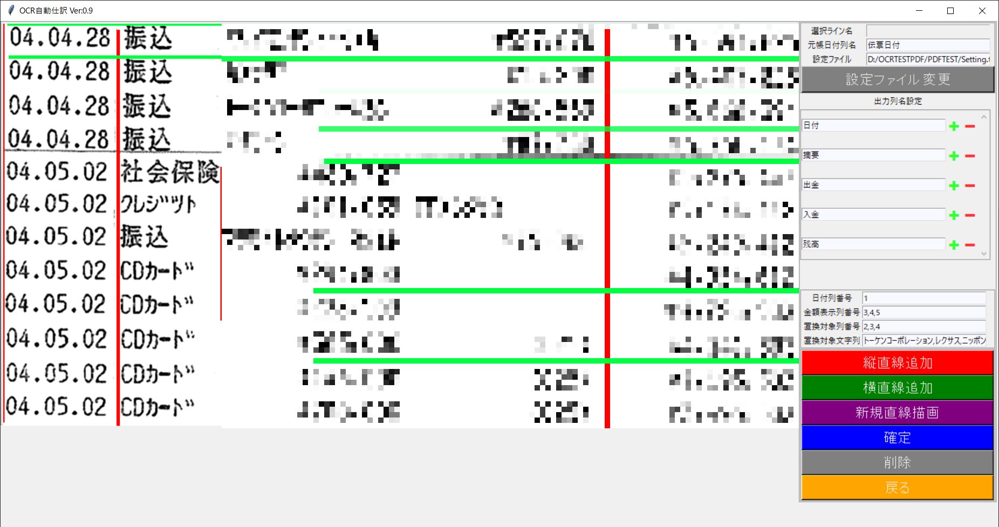
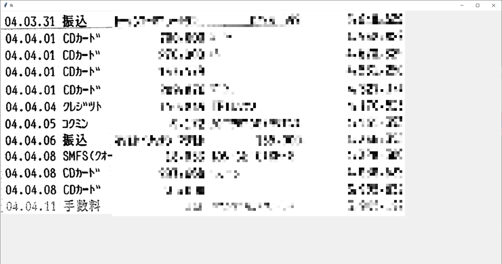
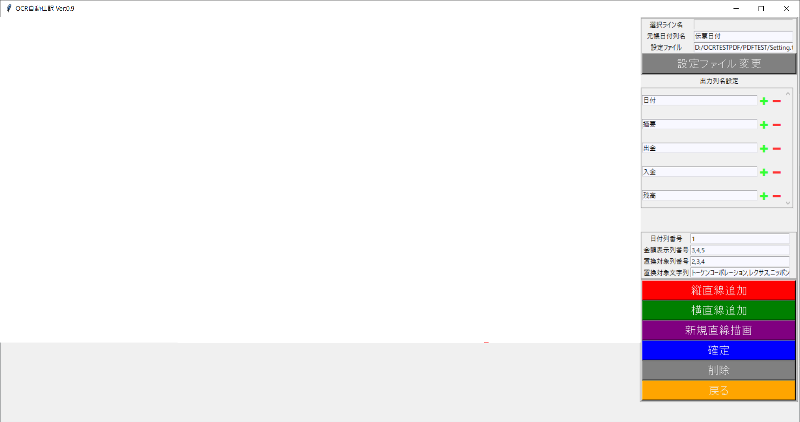
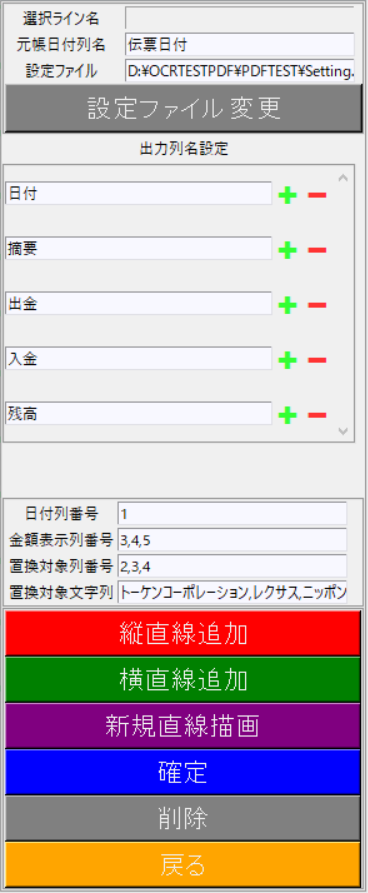
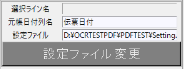
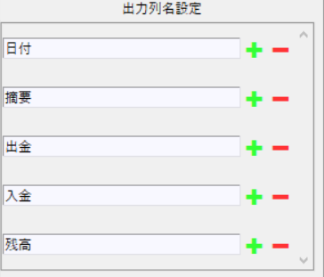
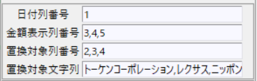
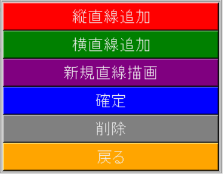

# TKINTERCV2Setting

* [機能](#機能)
* [利用ライブラリ](#利用ライブラリ)
* [self関数](#self関数)
* [関数](#関数)

# 機能 
#### OCR読取ウィンドウ軸設定や、出力列・変換対象列の設定
#### 下部ウィンドウに表示された画像に対し、
#### 上部ウィンドウで線を描画し、表形式としてOCR結果を出力する。
 

# 利用ライブラリ 

#### import tkinter as tk
#### ・Gui作成ライブラリ
 

#### import csv
#### ・CSVファイル操作ライブラリ
 

#### from PIL import Image, ImageTk
#### ・画像編集ライブラリ
 

#### import os
#### ・ファイル・フォルダ操作ライブラリ
 

#### import OCRFlow as OCRF
#### ・OCR抽出後の配列操作ライブラリ
 

#### import toml
#### ・tomlファイル操作ライブラリ
 

#### from CV2Setting import straightlinesetting
#### ・CV2で直線を描画し、縦軸と横軸リストを返す
 

#### import DataGrid as DG
#### ・データグリッド作成関数
 

#### import ScrollableFrame as SF
#### ・ScrollableFrame作成ライブラリ
 

#### import tomlCreate as toml_c
#### ・tomlファイル操作ライブラリ
 

# クラス関数
* [Application](#Application)
* [Applicationクラス変数](#Applicationクラス変数)
## Application 
    def __init__(self, master=None)
    ==================================================================    
    機能：イニシャライズ関数    
    ==================================================================
    引数：
        ・self：tk.Tk()
            GUIライブラリインスタンス自身
    ==================================================================

## Applicationクラス変数
* [Main](#Main)
* [フレーム](#フレーム)

## Main 
    ・self.master
        自身のインスタンス(GUIウィンドウ)
    ・self.top
        GUI上部ウィンドウ

    <要素>
        ・self.window_root.geometry("1480x750")
            GUIウィンドウサイズ(横,縦)
        ・self.window_root.title("GUI Image Editor v0.90")
            GUIウィンドウタイトル
        ・self.control
            外部GUI操作ライブラリのインスタンス
        ・self.dir_path
            デフォルトのパス(pyファイルのディレクトリ) 
        ・self.file_list
            ファイルリストの表示テキスト
        ・self.clip_enable
            ファイルを開いたフラグ
[戻る](#Main)

## フレーム 
* [self.master](#self.master)
* [self.topFrame](#self.topFrame)

### self.master 

    ・OCR読込対象画像表示ウィンドウ

### self.topFrame 

<要素>
* [frame0](#frame0)
  
    画像無し
    透過キャンバスフレーム(下部ウィンドウ画像を透過して表示し、線形描画して表形式を作成するフレーム)

[戻る](#self.topFrame)

### frame0 

透過キャンバスサイドメニュー

<要素>
* [Tframe](#Tframe)
* [self.SF](#self.SF)
* [Setframe](#Setframe)
* [frame](#frame)    

### Tframe 

    設定ファイルフレーム
    <要素>
        ・txt
            選択ライン名表示テキストボックス
        ・self.LimitCol
            元帳日付列名表示テキスト
        ・self.tomlurl
            設定ファイルURL表示テキスト
        ・self.tomlbutton
            設定ファイル変更ボタン
                <bind関数>：self.ChangeToml

[戻る](#frame0)

### self.SF 

    出力CSV列名設定フレーム(外部スクロールバーフレーム)
    toml設定ファイルの["ColList"]["List"]パラメーターから
    列名設定を読込テキストボックスを作成する

    <要素>
        ・self.Entries
            エントリーウィジェットのインスタンスリスト
            <bind関数>：<MouseWheel>：self.SF.mouse_y_scroll
            <bind関数>：<Return>：ColumnTomlIn
            <bind関数>：<Tab>：ColumnTomlIn
        ・self.insertEntries
            追加するボタンのインスタンスリスト
            <bind関数>：<MouseWheel>：self.SF.mouse_y_scroll            
        ・self.removeEntries
            削除するボタンのインスタンスリスト
            <bind関数>：<MouseWheel>：self.SF.mouse_y_scroll            
        ・self.index
            最新のインデックス番号(要素追加・削除用)
        ・self.indexes
            インデックスの並び(要素追加・削除用)
        ・self.ColList
            toml設定ファイルの["ColList"]["List"]パラメーター格納変数

[戻る](#frame0)

### Setframe 

    toml設定ファイルの表示・更新
    <要素>
        ・self.DaySet
        (toml設定ファイルの["Setframe"]["DaySetList"])

            日付列番号テキストボックス
            <bind関数>：<Return>：tomlreturn
            <bind関数>：<Tab>：tomlreturn

        ・self.MoneySet
        (toml設定ファイルの["Setframe"]["MoneySet"])

            金額表示列番号テキストボックス
            <bind関数>：<Return>：tomlreturn
            <bind関数>：<Tab>：tomlreturn            

        ・self.ReplaceSet
        (toml設定ファイルの["Setframe"]["ReplaceSet"])

            置換対象列番号テキストボックス
            <bind関数>：<Return>：tomlreturn
            <bind関数>：<Tab>：tomlreturn            
                        
        ・self.ReplaceStr
        (toml設定ファイルの["Setframe"]["ReplaceStr"])

            置換対象文字列テキストボックス
            <bind関数>：<Return>：tomlreturn
            <bind関数>：<Tab>：tomlreturn            

[戻る](#frame0)

### frame 

    透過キャンバスサイドメニュー
    <要素>
        ・button
            縦直線追加ボタン
            <bind関数>：lambda: StLine(self.top.forward, CW, CH)
        ・button2
            横直線追加ボタン
            <bind関数>：lambda: StWLine(self.top.forward, CW, CH)
        ・button3
            新規直線描画ボタン
            <bind関数>：lambda: NewLineCreate(self, self.top.forward, HCW, HCH)
        ・button4
            確定ボタン
            <bind関数>：lambda: EnterP(self.top.forward, HCW, HCH, self)
        ・button5
            削除ボタン
            <bind関数>：lambda: LineDelete(self.top.forward)
        ・button6
            戻るボタン
            <bind関数>：lambda: ReturnBack(self)

[戻る](#frame0)

# self関数 
* [ChangeToml](#ChangeToml)
* [TomlInsert](#TomlInsert)
* [InportIMG](#InportIMG)
* [unmap](#unmap)
* [map](#map)
* [change](#change)
* [insertEntry_click](#insertEntry_click)
* [removeEntry_click](#removeEntry_click)
* [updateEntries](#updateEntries)
* [createEntry](#createEntry)
* [GetEntryTextButton_click](#GetEntryTextButton_click)

### ChangeToml(self) 
    tomlリストを変更
[戻る](#self関数)

### TomlInsert(self, Ent, List) 
    tomlリストをTKentryに挿入
[戻る](#self関数)

### InportIMG(self)         
    下ウィンドウに画像をリサイズして配置
[戻る](#self関数)

### unmap(self, event)           
    上下ウィンドウ連携処理(上を隠す)
[戻る](#self関数)

### map(self, event)           
    上下ウィンドウ連携処理(上を表示)
[戻る](#self関数)

### change(self, event)           
    上下ウィンドウ連携処理(ウィンドウサイズ変更)
[戻る](#self関数)

### insertEntry_click(self, event, id)           
    列名設定項目追加ボタン処理
[戻る](#self関数)

### removeEntry_click(self, event, id)           
    列名設定項目削除ボタン処理
[戻る](#self関数)

### updateEntries(self, bar_x=False, bar_y=True)           
    列名設定項目を再配置
[戻る](#self関数)

### createEntry(self, next, bar_x=False, bar_y=True)           
    列名設定項目を作成して再配置
[戻る](#self関数)

### GetEntryTextButton_click(self)   
    列名設定項目取得関数
[戻る](#self関数)

# 関数 
* [ColumnTomlIn](#ColumnTomlIn)
* [tomlreturn](#tomlreturn)
* [ReturnNext](#ReturnNext)
* [ReturnBack](#ReturnBack)
* [NewLineCreate](#NewLineCreate)
* [tomlListCreate](#tomlListCreate)
* [LoadImg](#LoadImg)
* [StLine](#StLine)
* [StWLine](#StWLine)
* [Gra](#Gra)
* [listintCheck](#listintCheck)
* [EnterP](#EnterP)
* [unmap](#unmap)
* [map](#map)
* [change](#change)
* [LineDelete](#LineDelete)
* [AllLineDelete](#AllLineDelete)
* [click1](#click1)
* [drag1](#drag1)

### ColumnTomlIn(self) 
    toml列名設定の更新
[戻る](#関数)
    
### tomlreturn(self) 
    toml変換設定の更新
[戻る](#関数)

### ReturnNext(self) 
    次UI起動
[戻る](#関数)

### ReturnBack(self) 
    前UI起動
[戻る](#関数)

### NewLineCreate(self, selfC, HCW, HCH) 
    新規直線描画ボタン処理
[戻る](#関数)

### tomlListCreate(self) 
    リストボックス作成
[戻る](#関数)

### LoadImg(Wwidth, Wheight) 
    画像ファイル読込
[戻る](#関数)

### StLine(canvastop, CW, CH) 
    縦直線追加ボタン処理
[戻る](#関数)

### StWLine(canvastop, CW, CH) 
    横直線追加ボタン処理
[戻る](#関数)

### Gra(canvas, readcsv1, readcsv2, HCW, HCH) 
    透過キャンバス(上ウィンドウ)に罫線描画処理
[戻る](#関数)

### listintCheck(list) 
    条件テキストボックスの文字列に","があるか判定
[戻る](#関数)

### EnterP(self, HCW, HCH, selfmother) 
    確定ボタンクリック
[戻る](#関数)

### unmap(self) 
    最上部ウィンドウを非表示
[戻る](#関数)

### map(self) 
    self.topを最上部へ
[戻る](#関数)

### change(self) 
    最上部ウィンドウのサイズ同期
[戻る](#関数)

### LineDelete(self) 
    選択直線の削除
[戻る](#関数)

### AllLineDelete(self) 
    選択直線の削除
[戻る](#関数)

### click1(event) 
    縦直線描画処理(画面クリック)
[戻る](#関数)

### drag1(event) 
    縦直線移動処理(ドラッグ)
[戻る](#関数)
