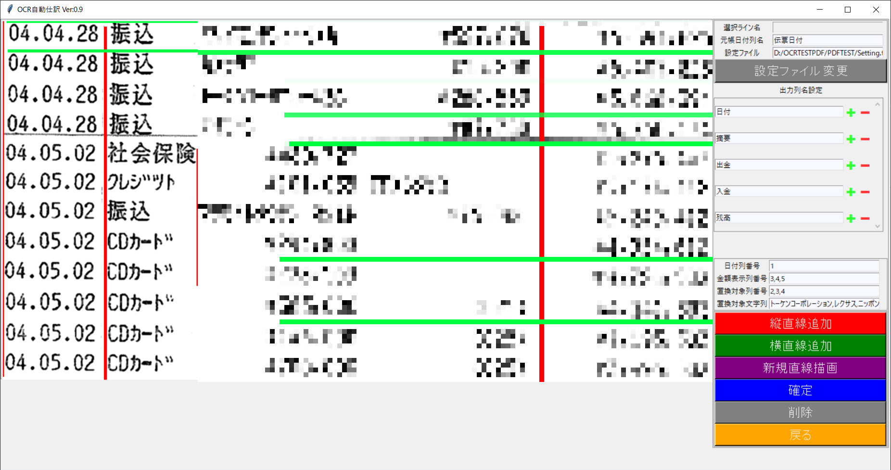
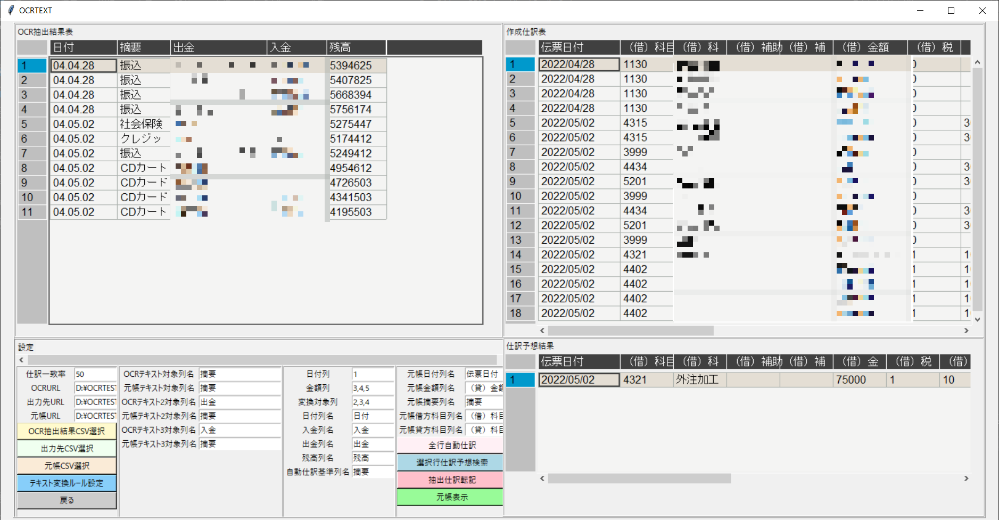

# TKInterGUI

* [フォルダ構成](#フォルダ構成)
* [機能](#機能)

## フォルダ構成

#### ウィンドウ

* [ViewGUI.py(開始ウィンドウ)](#ViewGUI.py(開始ウィンドウ))
* [TKINTERCV2Setting.py(OCR読取ウィンドウ)](#TKINTERCV2Setting.py(OCR読取ウィンドウ))
* [DataGrid.py(読取後仕訳表示ウィンドウ)](#DataGrid.py(読取後仕訳表示ウィンドウ))

#### ウィンドウ補助

* ControlGUI.py(ViewGUI.pyサブ)
* ModelImage.py(ViewGUI.pyサブ)
* *CSVOut.py(DataGrid.pyサブ)
* OCRFlow.py(TKINTERCV2Setting.pyサブ)
* Frame
  * DGFrame.py(DataGrid.pyサブ)
  * MyTable.py(DataGrid.pyサブ)
  * __pycache(pyファイルキャッシュ)__

#### 関数
* AutoJournal copy.py(自動変換スクリプト)
* AutoJournal.py(自動変換スクリプト)
* GCloudVision.py(GoogleVisionApiスクリプト)
* ImageChange.py(画像編集スクリプト)
* ScrollableFrame.py(Scバーフレーム作成スクリプト)
* WarekiHenkan.py(和暦変換スクリプト)
* TKEntry.py(エントリー作成スクリプト)

#### その他

* __pycache(pyファイルキャッシュ)__
* Mototyou(元帳保存ディレクトリ)
* BankSetting.toml(設定ファイル)
* cmapchange.csv(エンコード表)
* EventCheck.py(開発時のHandlerテストコード)
* ReadMe.md(このMarkdown)
* StraightListTate.csv(OCR解析時の縦軸リスト)
* StraightListYoko.csv(OCR解析時の横軸リスト)

## 機能

#### GoogleVisionApiを用いたOCR読取・自動仕訳作成機能
#### OCR対象画像に対し、縦・横の直線を挿入し、表形式としてOCR読取を実行。
#### その後、該当関与先の仕訳実績(ミロク元帳)から、指定の列のテキストを比較し、
#### 一致率の最も高い仕訳を抽出し、自動で仕訳インポートファイルを作成。
 

## ViewGUI.py(開始ウィンドウ) 

[詳細](ViewGUI.md)
#### 機能 

    画像編集ウィンドウ
    PDF→PNG変換や、トリミング等
    PDFファイルからOCR読取ができる画像ファイルを作成する。

## TKINTERCV2Setting.py(OCR読取ウィンドウ) 

[詳細](TKINTERCV2Setting.md)
#### 機能 

    OCR読取ウィンドウ軸設定や、出力列・変換対象列の設定
    下部ウィンドウに表示された画像に対し、
    上部ウィンドウで線を描画し、表形式としてOCR結果を出力する。

## DataGrid.py(読取後仕訳表示ウィンドウ) 

[詳細](DataGrid.md)
#### 機能 

    OCR結果に対して仕訳履歴から指定条件に一致する仕訳を抽出
