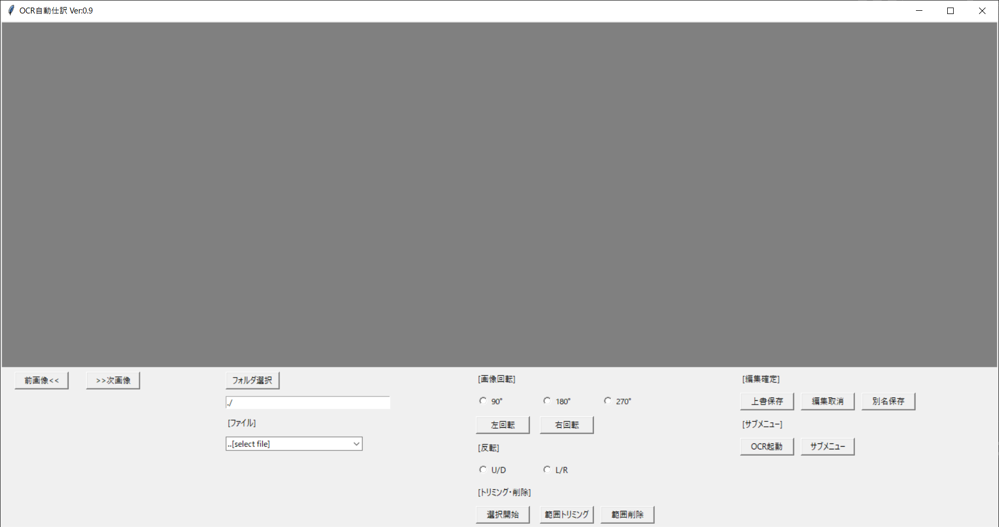
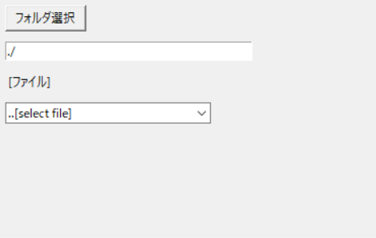
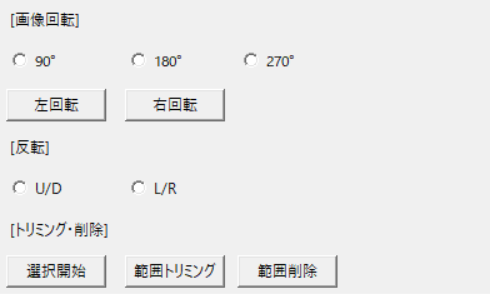
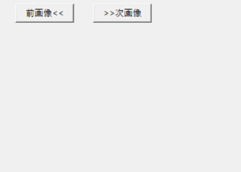
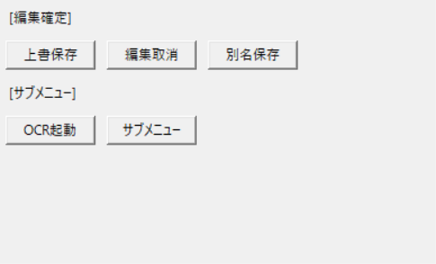

# ViewGUI

* [機能](#機能)
* [利用ライブラリ](#利用ライブラリ)
* [モジュール関数](#モジュール関数)

# 機能 
#### 画像編集ウィンドウ
#### PDF→PNG変換や、トリミング等
#### PDFファイルからOCR読取ができる画像ファイルを作成する。
 

# 利用ライブラリ 

#### import sys
#### ・Python実行環境情報操作ライブラリ
 

#### import ProgressBar as PB
#### ・プログレスバー作成関数
 

#### import tkinter as tk
#### ・GUI作成ライブラリ
 

#### from ControlGUI import ControlGUI
#### ・GUI操作関数
 

#### from TKINTERCV2Setting import Main
#### ・OCR読取GUI起動関数
 

# クラス関数
* [ViewGUI](#ViewGUI)
* [ViewGUIクラス変数](#ViewGUIクラス変数)
## ViewGUI 
    def　__init__(self, window_root, default_path)
    ==================================================================    
    機能：イニシャライズ関数    
    ==================================================================
    引数：
        ・self：tk.Tk()
            GUIライブラリインスタンス自身
        ・window_root
            GUIライブラリインスタンスルート   
        ・default_path
            デフォルトのパス(pyファイルのディレクトリ)
    ==================================================================
## ViewGUIクラス変数 
* [Main](#Main)
* [フレーム](#フレーム)
  
## Main 
    ・self.window_root
        自身のインスタンス(GUIウィンドウ)            

    <要素>
        ・self.window_root.geometry("1480x750")
            GUIウィンドウサイズ(横,縦)
        ・self.window_root.title("GUI Image Editor v0.90")
            GUIウィンドウタイトル
        ・self.control
            外部GUI操作ライブラリのインスタンス
        ・self.dir_path
            デフォルトのパス(pyファイルのディレクトリ) 
        ・self.file_list
            ファイルリストの表示テキスト
        ・self.clip_enable
            ファイルを開いたフラグ
[戻る](#Main)

## フレーム 
* [self.window_sub_ctrl1](#self.window_sub_ctrl1)
* [self.window_sub_ctrl2](#self.window_sub_ctrl2)
* [self.window_sub_ctrl3](#self.window_sub_ctrl3)
* [self.window_sub_ctrl4](#self.window_sub_ctrl4)
* [self.window_sub_FrameCanvas](#self.window_sub_FrameCanvas)

### self.window_sub_ctrl1 

    <要素>
        ・self.button_setdir
            フォルダ選択ボタン
                <bind関数>：self.event_set_folder                    
        ・self.str_dir
            フォルダ選択テキストボックス
        ・self.combo_file
            ファイル選択コンボボックス
[戻る](#フレーム)

### self.window_sub_ctrl2 

    <要素>
        ・button_RightLotate
            右回転ボタン
                <bind関数>：self.button_RightLotate
        ・button_LeftLotate
            左回転ボタン
                <bind関数>：self.button_LeftLotate
        ・self.radio_intvar1
            画像回転ラジオボタン
                <bind関数>：self.event_rotate
        ・self.radio_intvar2
            画像反転ラジオボタン
                <bind関数>：self.event_flip
        ・button_clip_start
            選択開始ボタン
                <bind関数>：self.event_clip_try
        ・button_clip_done
            範囲トリミングボタン
                <bind関数>：self.event_clip_done
        ・button_clip_Erace
            範囲削除ボタン
                <bind関数>：self.event_clip_Erace
[戻る](#フレーム)

### self.window_sub_ctrl3 

    <要素>
        ・button_next
            次画像ボタン
                <bind関数>：self.event_next
        ・button_prev
            前画像ボタン
                <bind関数>：self.event_prev
[戻る](#フレーム)

### self.window_sub_ctrl4       

    <要素>
        ・button_Oversave 
            上書保存ボタン
            <bind関数>：self.event_Oversave
        ・button_undo 
            編集取消ボタン
            <bind関数>：self.event_undo
        ・button_Oversave 
            別名保存ボタン
            <bind関数>：self.event_save
        ・button_LinOCR 
            OCR起動ボタン
            <bind関数>：self.LinOCROpen                        
        ・button_SubMenu 
            サブメニューボタン
            <bind関数>：self.event_menu  
[戻る](#フレーム)

### self.window_sub_FrameCanvas 

    <要素>
        ・self.window_sub_canvas
            キャンバス
[戻る](#フレーム)

# モジュール関数 

* def Resize(self, Resizewidth, Resizeheight):

* def menubutton1_click(self):

* def menubutton2_click(self, textbox1):

* def menubutton3_click(self, textbox2):

* def button_LeftLotate(self, event=None):

* def button_RightLotate(self, event=None):

* def event_set_folder(self):

* def event_updatefile(self):

* def event_selectfile(self, event):

* def event_prev(self):

* def event_next(self):

* def event_rotate(self):

* def event_flip(self):

* def event_clip_try(self):

* def event_clip_done(self):

* def event_clip_Erace(self):

* def event_clip_start(self, event):

* def event_clip_keep(self, event):

* def event_clip_end(self, event):

* def event_save(self):

* def event_Oversave(self):

* def event_undo(self):

* def LinOCROpen(self):
  
[戻る](#モジュール関数)