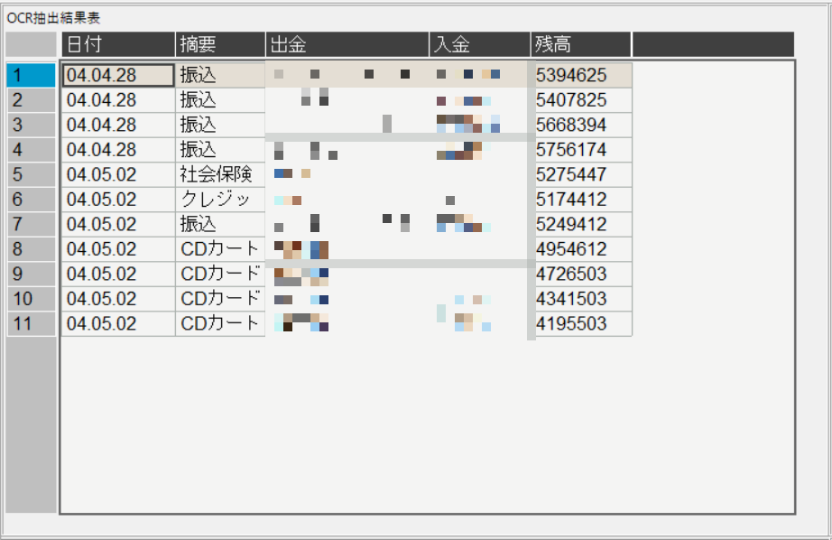
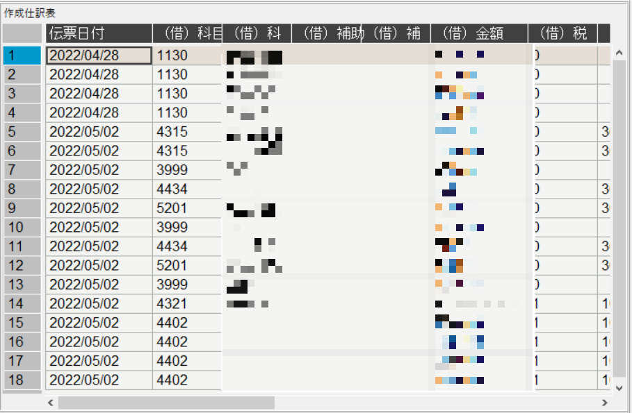
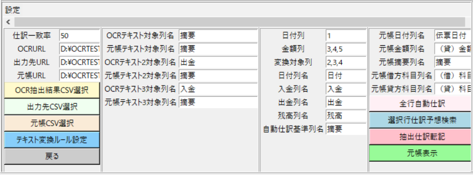
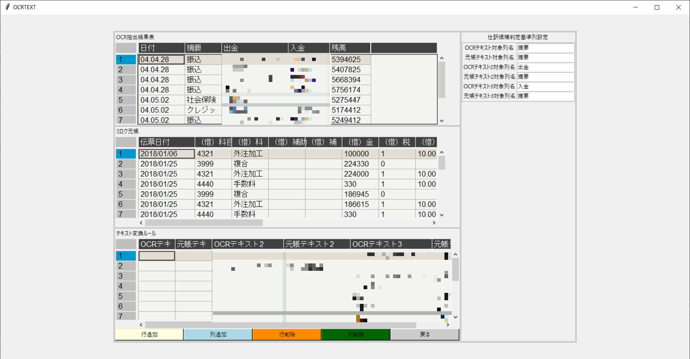
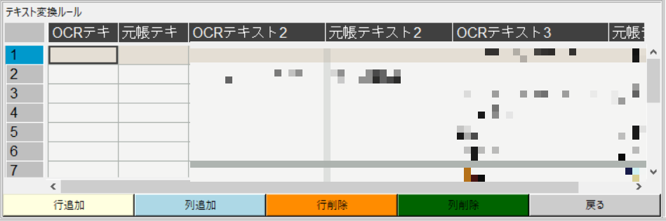
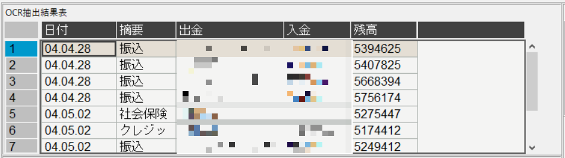
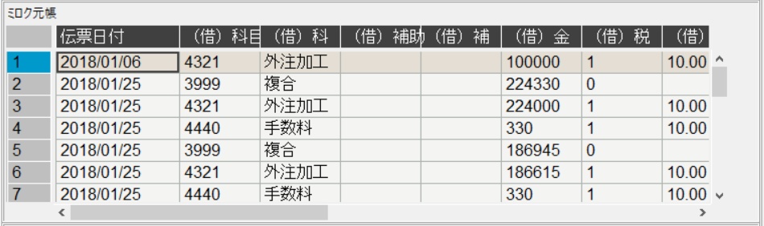

# DataGrid

* [機能](#機能)
* [利用ライブラリ](#利用ライブラリ)
* [self関数](#self関数)
* [関数](#関数)

# 機能 
#### OCR結果に対して仕訳履歴から指定条件に一致する仕訳を抽出
 

# 利用ライブラリ 

#### import tkinter as tk
#### ・Gui作成ライブラリ
 

#### import numpy as np
#### ・高速数値計算ライブラリ
 

#### import pandas as pd
#### ・データ分析ライブラリ
 

#### import csv
#### ・CSVファイル操作ライブラリ
 

#### import toml
#### ・tomlファイル読込ライブラリ
 

#### import AutoJournal as AJ
#### ・仕訳抽出関数
 

#### import CSVOut as CSVO
#### ・CSVファイル操作関数
 

#### import TKEntry as tke
#### ・特殊GUI作成関数
 

#### import re
#### ・文字列正規表現操作ライブラリ
 

#### import Frame.DGFrame as DGF
#### ・特殊GUI作成関数
 

# クラス関数
* [DataGrid](#DataGrid)
* [DataGridクラス変数](#DataGridクラス変数)
## Application 
    def __init__(self, window_root, default_path)
    ==================================================================    
    機能：イニシャライズ関数    
    ==================================================================
    引数：
        ・self：tk.Tk()
            GUIライブラリインスタンス自身
        ・window_root
            GUIライブラリインスタンスルート   
        ・default_path
            デフォルトのパス(pyファイルのディレクトリ)
    ==================================================================

## DataGridクラス変数
* [Main](#Main)
* [フレーム](#フレーム)

## Main 
    ・self.root
        自身のインスタンス(GUIウィンドウ)
    <要素>

[戻る](#Main)

## フレーム 
* [self.Main_Frame](#self.Main_Frame)
* [self.Sub_Frame](#self.Sub_Frame) 

### self.Main_Frame 

OCR読込対象画像表示ウィンドウ

<クラス変数>

    ・self.Banktoml
        toml設定ファイル
    ・self.FileName
        OCR結果CSVURL
    ・self.JounalFileName
        自動仕訳出力先CSVURL
    ・self.Roolurl
        ミロク元帳CSVURL
    ・self.AJSeturl
        仕訳候補表示用CSVURL
    ・self.ChangeTxtURL
        摘要変換ルールCSVURL
    ・self.tomlList
        toml設定ファイル["ParList"]["Name"]
    ・enc
        摘要変換ルールエンコード
    ・pt4df
        摘要変換ルールCSVテーブル
    ・self.ChangeTxtColumns
        摘要変換ルール列名
    ・self.HidukeColNo
        OCR結果日付列番
    ・self.MoneyCol
        OCR結果金額列番
    ・self.ChangeTextCol
        OCR結果変換対象列番
    ・self.ColumnName
        OCR結果列名リスト(OCR出力列名)
    ・self.HidukeColName
        OCR結果日付列名
    ・self.NyuName
        OCR結果入金列名
    ・self.SyutuName
        OCR結果出金列名
    ・self.ZanName
        OCR結果残高列名
    ・self.Henkan
        OCR結果摘要列名
    ・self.ChangeText
        自動仕訳変換候補

<要素>
* [self.pt](#self.pt)
* [self.pt2](#self.pt2)
* [self.pt3](#self.pt3)

### self.pt 

OCR抽出結果表

    DGF.create_Frame

    <要素>

[戻る](#フレーム)

### self.pt2 

作成仕訳表

    DGF.create_Frame2

    <要素>

[戻る](#フレーム)

### self.pt3 

設定メインフレーム

    DGF.create_SettingFrame

    <要素>

[戻る](#フレーム)

### self.Sub_Frame 

<クラス変数>

    ・self.Banktoml
        toml設定ファイル
    ・self.FileName
        OCR結果CSVURL
    ・self.JounalFileName
        自動仕訳出力先CSVURL
    ・self.Roolurl
        ミロク元帳CSVURL
    ・self.AJSeturl
        仕訳候補表示用CSVURL
    ・self.ChangeTxtURL
        摘要変換ルールCSVURL
    ・self.tomlList
        toml設定ファイル["ParList"]["Name"]
    ・enc
        摘要変換ルールエンコード
    ・pt4df
        摘要変換ルールCSVテーブル
    ・self.ChangeTxtColumns
        摘要変換ルール列名
    ・self.HidukeColNo
        OCR結果日付列番
    ・self.MoneyCol
        OCR結果金額列番
    ・self.ChangeTextCol
        OCR結果変換対象列番
    ・self.ColumnName
        OCR結果列名リスト(OCR出力列名)
    ・self.HidukeColName
        OCR結果日付列名
    ・self.NyuName
        OCR結果入金列名
    ・self.SyutuName
        OCR結果出金列名
    ・self.ZanName
        OCR結果残高列名
    ・self.Henkan
        OCR結果摘要列名
    ・self.ChangeText
        自動仕訳変換候補

<要素>
* [self.pt4](#self.pt4)
* [self.pt5](#self.pt5)
* [self.pt6](#self.pt6)

### self.pt4 

テキスト変換ルール

    DGF.create_Frame3

    <要素>
        ・self.Sub_RowInsert
            行追加ボタン
            <bind関数>：<Return>：self(DataGrid.py).Sub_RowInsert

        ・self.Sub_ColumnInsert
            列追加ボタン
            <bind関数>：<Return>：self(DataGrid.py).Sub_ColumnInsert

        ・self.Sub_RowDelete
            行削除ボタン
            <bind関数>：<Return>：self(DataGrid.py).Sub_RowDelete

        ・self.Sub_ColumnDelete
            列削除ボタン
            <bind関数>：<Return>：self(DataGrid.py).Sub_ColumnDelete

        ・self.Sub_CloseBtn
            戻るボタン
            <bind関数>：<Return>：self(DataGrid.py).Sub_ReturnBack

[戻る](#self.Sub_Frame)

### self.pt5 

OCR抽出結果表

    DGF.create_Frame4

    <要素>

[戻る](#self.Sub_Frame)

### self.pt6 

OCR抽出結果表

    DGF.create_Frame4

    <要素>

[戻る](#self.Sub_Frame)